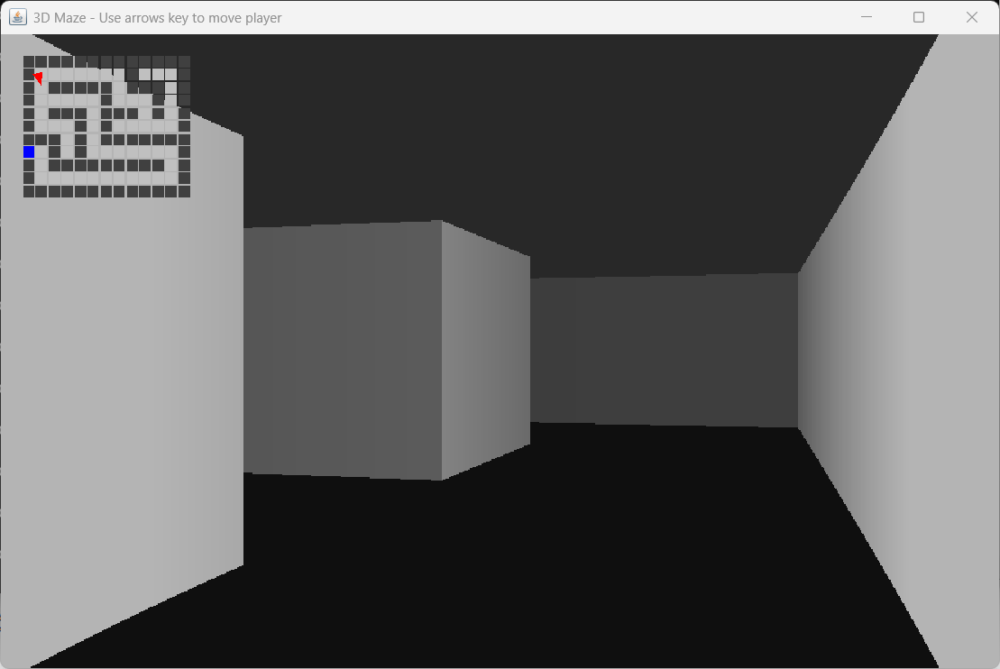

# Maze
The *Maze* class generates and solves rectangular mazes using DFS and BFS algorithms without stackoverflows.
This class implement a maze as an array of cells, each cell can be an empty place or a wall or a colored place, used to perform flooding and other tasks.
*TestMaze* is a test tool to verify class Maze, while *MazeGame* is a mini game to run through the maze.
Java 8 or later is required to run the application.

## Quick Start

```java
Random random = new Random();
//out door shall be placed on the enclosure wall
Cell out_door = new Cell(0, 1 + 2 * random.nextInt(MAZE_HEIGHT / 2));
Maze mymaze = new Maze(MAZE_WIDTH, MAZE_HEIGHT, out_door);
//get local deep copy of the maze itself
int[][]	maze = mymaze.cloneMaze();
//inner cell is the typical place where a player is put at the beginning of a game
Cell inner_cell = mymaze.getInnerCell();
```

## Run Test
Just use the following command to run the test:
```
usage: java -cp classes test.TestMaze [width [height]]

optional parameters width and height must be odd values greater than 3
```
This command can create a maze 1001 x 1001 in few seconds

## Run Game Demo
Just use the following command to run the mini game:
```
usage: java -cp classes demo.MazeGame

```
Move the player (red circle) using arrow keys

Try MazeGame using the browser without downloading anything using the *SnapCode* tool: [MazeGame via SnapCode](https://reportmill.com/SnapCode/app/#open:https://github.com/javalc6/maze.zip#/demo/MazeGame.java)

## Run 3D Game Demo
Just use the following command to run the mini game 3D:
```
usage: java -cp classes demo.Maze3D

move the player (red triangle in minimap) using arrow keys
```

## Example
Running the test with *TestMaze 15* may provide following output:
```
checkReachability: true
***************
....*  ...*...*
***.***.*.*.*.*
* *.*...*.*.*.*
* *.*.***.*.*.*
*...*.* *...*.*
*.***.* *****.*
*.....*     *.*
******* *** *.*
*...*...*   *.*
*.*.*.*.*****.*
*.*...*.*...*.*
*.*****.*.*.*.*
*.... *...*...*
***************
length of shortest path=81
```

## Screenshot
Running *MazeGame*:


129 x 121 maze:


Running *Maze3D*:


