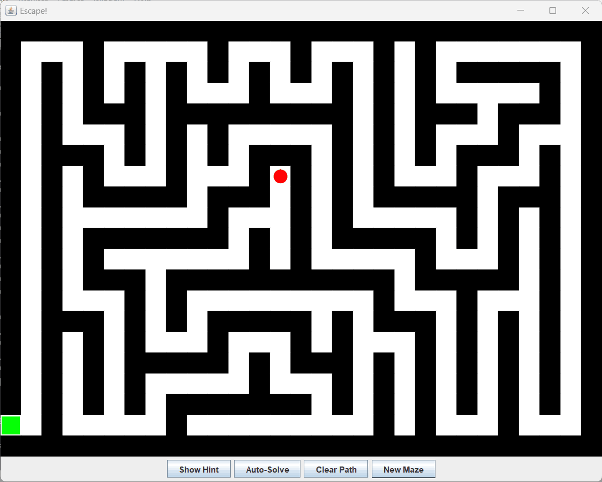
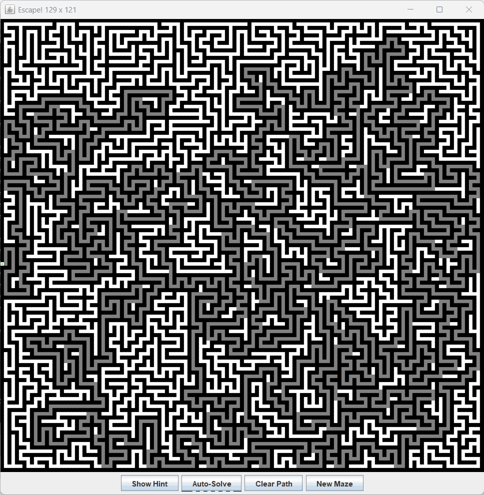

# Maze
The *Maze* class generates and solves rectangular mazes using DFS and BFS algorithms without stackoverflows.
This class implement a maze as an array of cells, each cell can be an empty place or a wall or a colored place, used to perform flooding and other tasks.
*TestMaze* is a test tool to verify class Maze, while *MazeGame* is a mini game to run through the maze.
Java 8 or later is required to run the application.

# Compile
Run following command to build the application:
```
ant compile
```

# Run Test
Just use the following command to run the test:
```
usage: java -cp classes test.TestMaze [width [height]]

optional parameters width and height must be odd values greater than 3

this command can create a maze 1001 x 1001 in few seconds
```

# Run Game Demo
Just use the following command to run the mini game:
```
usage: java -cp classes demo.MazeGame

move the player (red circle) using arrow keys
```

# Example

Running the test with *TestMaze 15* may provide following output:
```
checkReachability: true
***************
....*  ...*...*
***.***.*.*.*.*
* *.*...*.*.*.*
* *.*.***.*.*.*
*...*.* *...*.*
*.***.* *****.*
*.....*     *.*
******* *** *.*
*...*...*   *.*
*.*.*.*.*****.*
*.*...*.*...*.*
*.*****.*.*.*.*
*.... *...*...*
***************
length of shortest path=81
```

# Screenshot
Running *MazeGame*:



129 x 121 maze:


